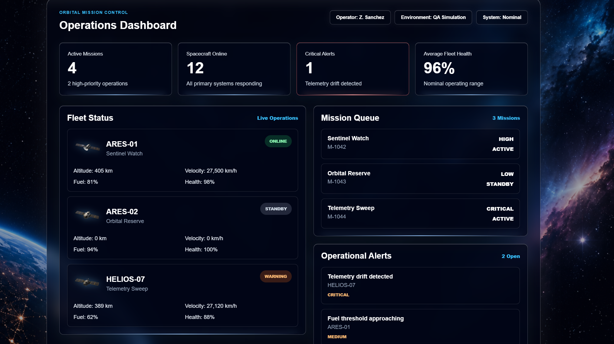

# Orbital Mission Control QA

A space-themed QA automation portfolio project built for practicing modern front-end testing workflows with React, TypeScript, Vite, Git, and Playwright.

This project simulates an orbital mission control dashboard used to monitor spacecraft fleet status, mission queues, and operational alerts.

## Project Purpose

The goal of this project is to demonstrate software quality assurance skills through a realistic mission operations interface. The application is designed to support future automated testing with Playwright, including login validation, dashboard verification, UI state checks, and regression testing.

## Tech Stack

- React
- TypeScript
- Vite
- Playwright
- Git

## Current Features

- Mission control login screen
- Operations dashboard
- Space-themed background
- Glassmorphism user interface
- Fleet Status cards with spacecraft assets
- Mission Queue panel
- Operational Alerts panel
- Responsive dashboard layout

## Screenshots

### Dashboard V1

## Testing Plan

Playwright testing will be added next. Planned test coverage includes:

- Login page loads correctly
- User can complete the login flow
- Dashboard loads after login
- Fleet Status cards are visible
- Mission Queue items are visible
- Operational Alerts are visible
- Core dashboard UI elements remain stable during regression testing

## Project Status

Current status: Front-end dashboard completed. Playwright test automation coming next.