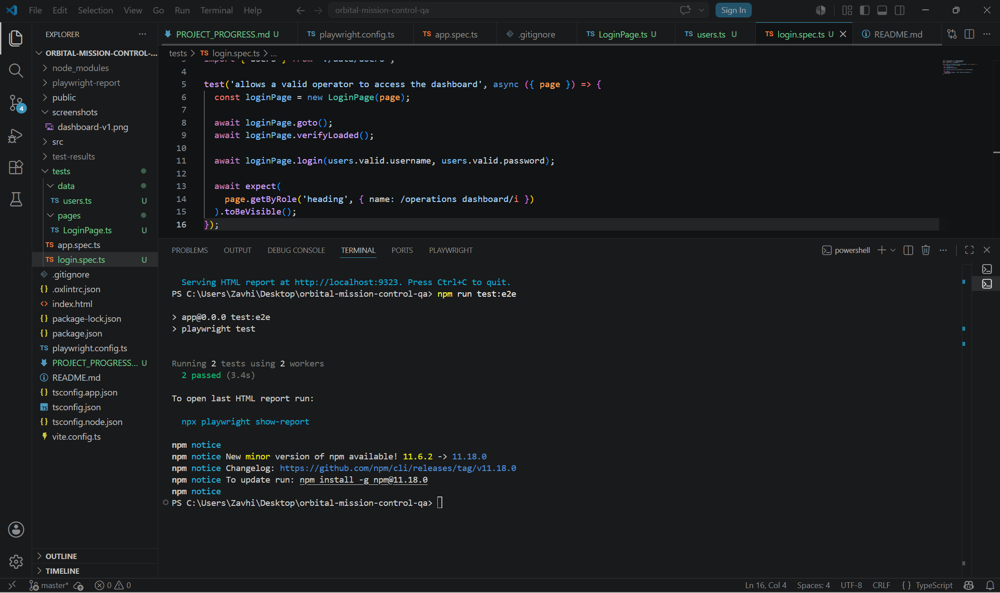
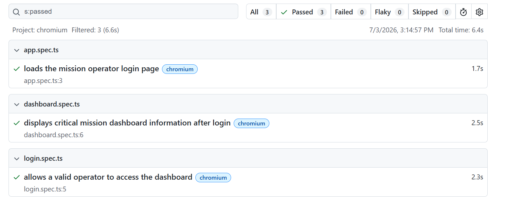
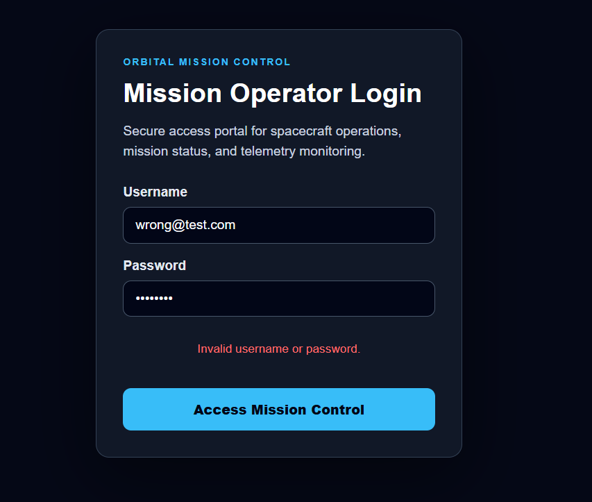
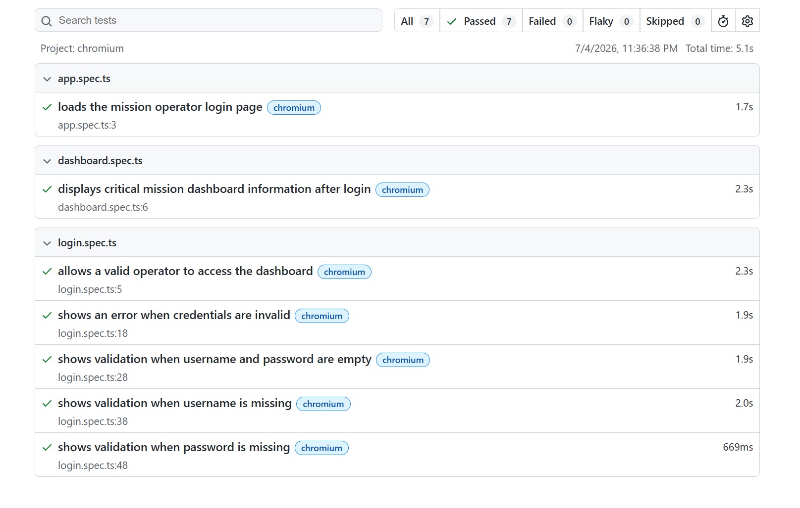
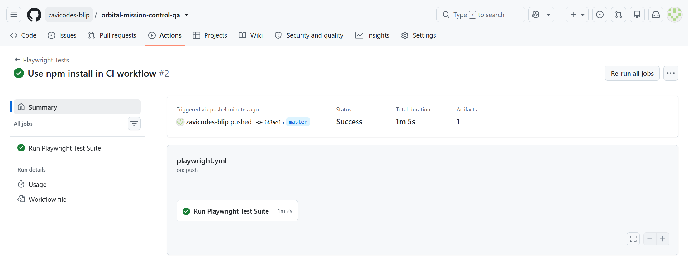
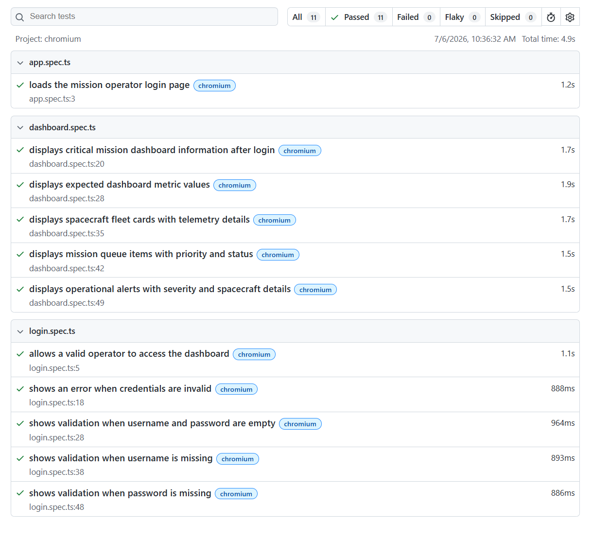
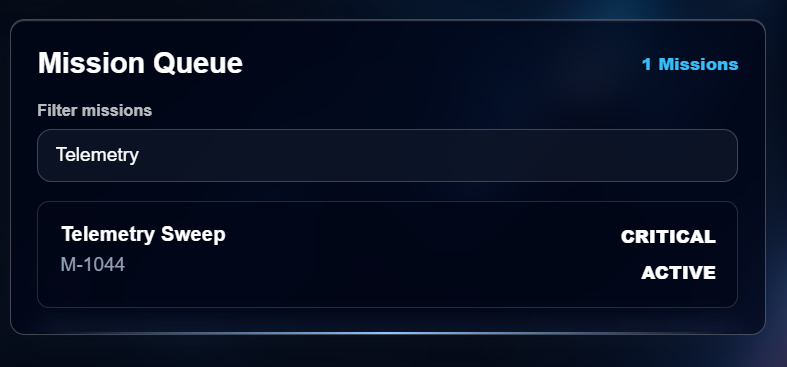
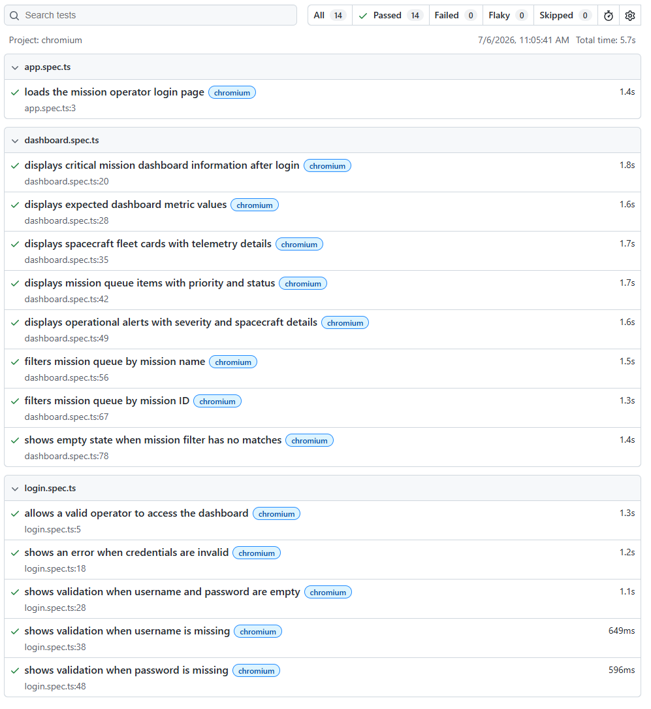
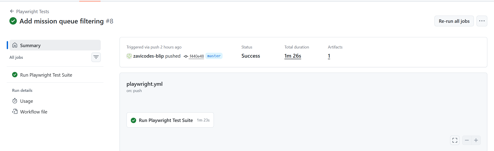

# Orbital Mission Control QA

[](https://github.com/zavicodes-blip/orbital-mission-control-qa/actions/workflows/playwright.yml)

A space-themed QA automation portfolio project built with React, TypeScript, Vite, Git, and Playwright.

This project simulates an orbital mission control dashboard used to monitor spacecraft fleet status, mission queues, and operational alerts. It was built as a production-style QA portfolio project to demonstrate front-end testing, login validation, regression coverage, Page Object Model structure, and clean Git milestone history.

## Portfolio Summary

Orbital Mission Control QA is a full-stack-style front-end QA portfolio project that demonstrates how a QA engineer can build, validate, document, and continuously test a mission-operations dashboard.

The project includes a React + TypeScript application, Playwright end-to-end automation, positive and negative login validation, detailed dashboard regression tests, mission queue filtering tests, manual QA test cases, defect reports, and GitHub Actions CI.

This project is designed to demonstrate practical QA skills including:

* Writing maintainable automated tests with Playwright
* Organizing tests with the Page Object Model
* Separating test data from test logic
* Validating positive and negative user flows
* Testing dashboard data and UI regression behavior
* Documenting manual test cases and resolved defects
* Running automated tests through GitHub Actions
* Maintaining a clean milestone-based Git history

## Current Project Snapshot

* Automated test suite: `14 passing Playwright tests`
* CI status: GitHub Actions workflow passing
* Test architecture: Page Object Model with separated test data
* QA documentation: Test strategy, manual test cases, and defect reports
* Main tested workflows: login validation, dashboard regression, mission queue filtering

## Project Purpose

The goal of this project is to demonstrate modern software quality assurance skills through a realistic mission operations interface.

This repository shows the ability to:

* Build and test a React + TypeScript application
* Write automated end-to-end tests with Playwright
* Organize tests using the Page Object Model
* Separate test data from test logic
* Validate both positive and negative login scenarios
* Verify dashboard UI elements through regression tests
* Generate and capture Playwright HTML reports
* Maintain a clean Git history with milestone-based commits

## Tech Stack

* React
* TypeScript
* Vite
* Playwright
* Git
* GitHub Actions

## Application Features

* Mission operator login screen
* Login validation for valid, invalid, and empty credentials
* Operations dashboard
* Space-themed background
* Glassmorphism user interface
* Fleet Status cards with spacecraft assets
* Mission Queue panel
* Operational Alerts panel
* Responsive dashboard layout

## Test Coverage

The Playwright test suite currently covers:

* Login page smoke test
* Successful operator login
* Invalid username/password validation
* Empty username/password validation
* Missing username validation
* Missing password validation
* Dashboard verification after login
* Dashboard metric value validation
* Mission queue filtering by mission name
* Mission queue filtering by mission ID
* Mission queue empty-state validation
* Spacecraft fleet card and telemetry validation
* Mission queue priority and status validation
* Operational alert severity and spacecraft validation

Current full test suite result:

```text
14 passed
```

## Test Architecture

The test suite is organized with a clean QA automation structure:

```text
tests
│   app.spec.ts
│   dashboard.spec.ts
│   login.spec.ts
│
├───data
│       users.ts
│
└───pages
        DashboardPage.ts
        LoginPage.ts
```

## QA Documentation

Additional QA documentation is included in the `docs` folder:

* [Test Strategy](./docs/TEST_STRATEGY.md)
* [Manual Test Cases](./docs/MANUAL_TEST_CASES.md)
* [Defect Reports](./docs/DEFECT_REPORTS.md)

### Page Object Model

The project uses Page Object Model classes to keep locators and reusable actions separate from test assertions.

Examples:

* `LoginPage.ts` handles login page actions and validation checks
* `DashboardPage.ts` handles dashboard visibility checks

### Test Data Separation

Test credentials are stored separately in:

```text
tests/data/users.ts
```

This keeps the test logic cleaner and easier to maintain.

## Demo Credentials

Valid login credentials for the demo application:

```text
Username: operator@mission.local
Password: orbit123
```

## Screenshots

### Dashboard


### Playwright Test Run



### Playwright HTML Report



### Login Validation



### Updated Login Validation Test Report



### GitHub Actions CI



### Dashboard Regression Test Report



### Mission Queue Filtering



### Mission Filter Playwright Report



### Mission Filter GitHub Actions CI



## Running the Project

Install dependencies:

```bash
npm install
```

Start the development server:

```bash
npm run dev
```

Run the production build check:

```bash
npm run build
```

Run the full Playwright test suite:

```bash
npx playwright test
```

Run only the login tests:

```bash
npx playwright test tests/login.spec.ts
```

Open the Playwright HTML report:

```bash
npx playwright show-report
```

## Continuous Integration

This project includes a GitHub Actions workflow that runs on pushes and pull requests to the `master` branch.

The CI workflow:

* Installs dependencies
* Installs Playwright browsers
* Runs the production build
* Runs the full Playwright test suite
* Uploads the Playwright HTML report as a workflow artifact

## Current Project Status

Current status: Core application and Playwright automation foundation completed.

Completed milestones:

* React + TypeScript + Vite project setup
* Mission operator login page
* Operations dashboard
* Space-themed UI and spacecraft assets
* Login validation
* Playwright configuration
* Smoke test
* Positive login test
* Negative login validation tests
* Dashboard verification test
* Detailed dashboard regression tests
* Mission queue filtering
* Mission queue filtering tests
* Page Object Model implementation
* Test data separation
* HTML reporting
* Portfolio screenshots
* Clean milestone-based Git commits
* GitHub Actions CI workflow for Playwright test execution

## Next Planned Improvements

Future improvements may include:

* Additional dashboard regression tests
* Alert filtering or state-based UI checks
* Accessibility-focused assertions
* GitHub Actions status badge in README
* Expanded README documentation with test strategy notes
